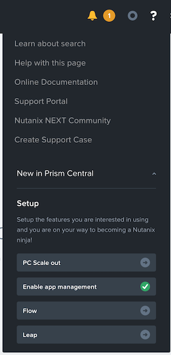
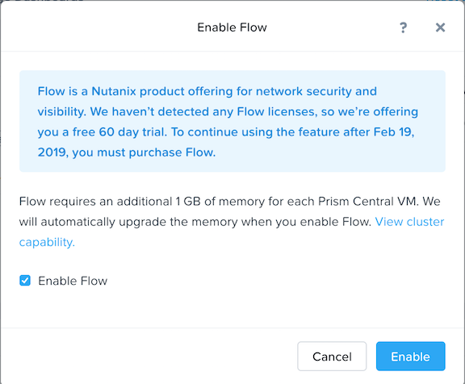
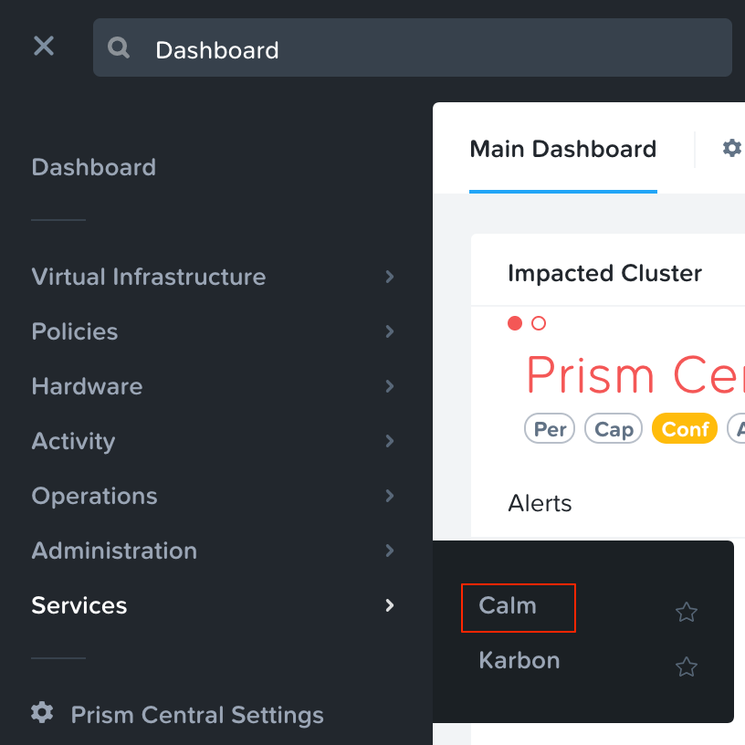
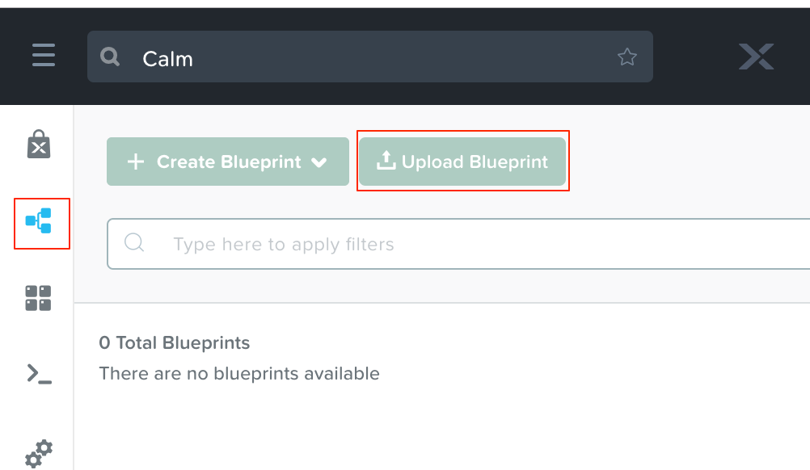

.. _flow_enable_and_lab_setup:

--------------------------
Flow: Enable and Lab Setup
--------------------------

Overview
++++++++

.. note::

  Estimated time to complete: 10-20 MINUTES

In this exercise you will enable Nutanix Flow, formally known as Microsegmentation, and create the VMs to be used throughout the remaining Flow exercises, **if you have not cloned the VMs already as part of the Lab - Deploying Workloads exercise**.

Enabling Flow
++++++++++++++++++++++++++

Open https://<Prism-Central-IP>:9440/ in the Chrome browser and log in.

.. note::

  Do not use Firefox for the Flow policy steps in the following exercises.

From the navigation bar, click the question mark at the top right corner and expand the **New in Prism Central** section of the menu.

Click **Flow**.

Select the **Enable Flow** check box within the **Enable Flow** dialog box.

.. note::

  Flow can only be enabled once per Prism Central instance. If **Flow** displays a green check mark next to it, that means Flow has already been enabled for the Prism Central instance being used.

Click **Enable**

Import Blueprint within Calm
++++++++++++++++++++++++++++

.. note::

In this section we will import a Calm Blueprint into Prism Central that will setup the VMs needed for this lab upon Launching.

To import a Blueprint within Calm, ensure it is enabled (Please see the Enable Calm optional lab if this isn't the case).

Download the blueprint for this lab at the following link:
<BP link>

From the Dashboard within Prism, Click the <icon here> Navigation menu on the top left then select **Services** > **Calm**.

Click on the blueprint icon from the menu on the left (hovering over all of the icons shows their labels).

Click **Upload Blueprint** and navigate to the blueprint provided for this course at:

Name the blueprint with your initials, **abc_TaskManager** and choose the **Default** project.

Once the blueprint finishes uploading, it will automatically open.

Let's configure the non-Flow related changes of this blueprint before continuing.

Update the credentials:
  Edit the credentials for Linux machines:
  Click on **Credentials** from the top menu.
  Select **CENTOS**.
  Change the **Username** to **root**
  Change the **Secret Type** to **Password**.
  Type **nutanix/4u** in the **Password** field.
  .. figure:: images/credentials.png

  Edit the credentials for Windows machines:
  Click on **Credentials** from the top menu (if not there already).
  Select **WINDOWS**.
  Change the **Secret Type** to **Password**.
  Type **nutanix/4u** in the **Password** field.
  .. figure:: Mysql_password.png

Click **Save** from the top right menu, then click the **Back** green button.

Update the Mysql_password application profile variable:
  On the right hand side, click on the textbox next to Mysql_password and type **nutanix/4u** in the **Password** field.
  Click **Save** from the top right menu.

Add the Primary network to to NIC in each of the VMs.

Edit the VM Name field in each of the VMs to add your initials. Go under VM Configuration and place your initials in front of the name field similar to the example shown below:
yourInitials-MYSQL-@@{calm_array_index}@@-@@{calm_time}@@

Takeaways
+++++++++

- Microsegmentation, part of Flow, is a decentralized security framework included from within Prism Central.
- Microsegmentation offers additional protection against malicious threats that originate from within the data center and spread laterally, from one machine to another.
- Once Flow is enabled in the cluster, VMs can be easily protected through Security Policies as created in the Prism Central UI. These function as labels that can easily be applied to VMs without any additional network setup.
- Calm blueprints can be used to quickly import an application configuration and have the cluster provision the resources needed for the particular application to run automatically.
