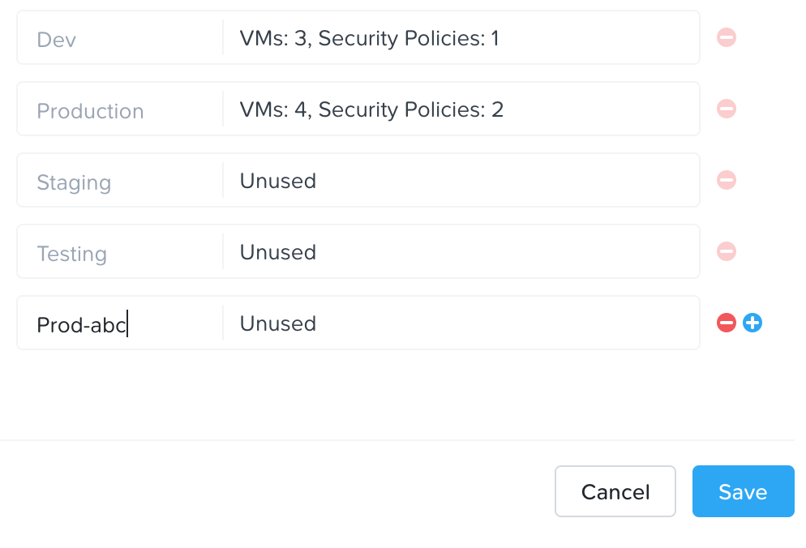
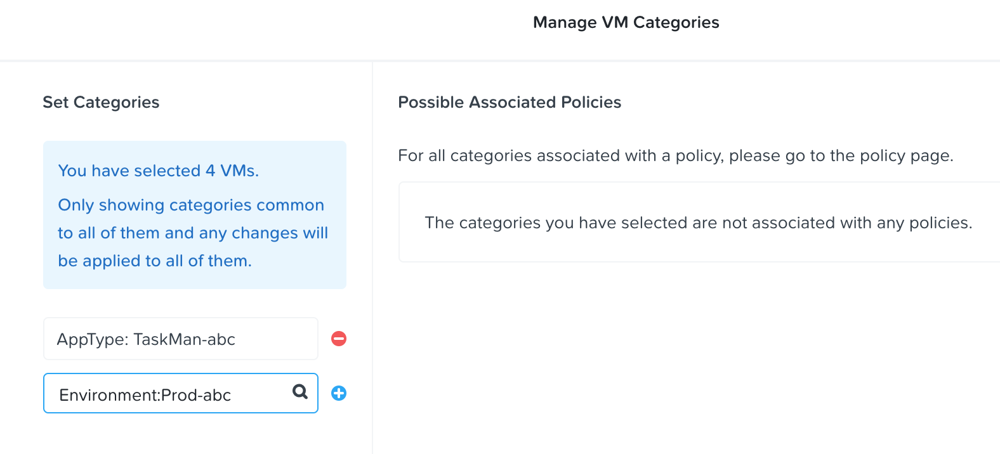
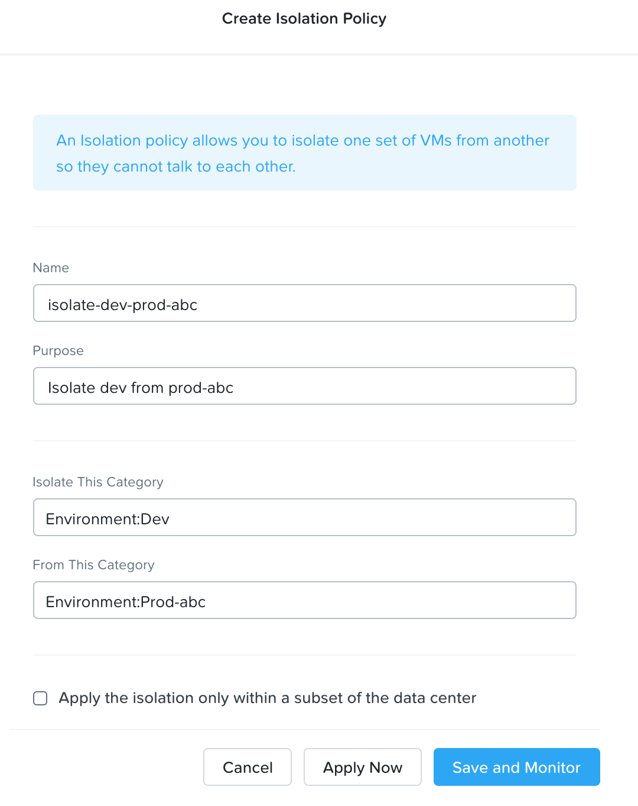
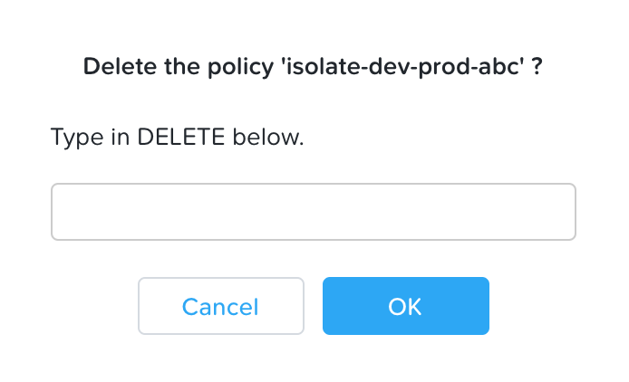

.. _flow_isolate_environments:

--------------------------
Flow: Isolate Environments
--------------------------

Overview
++++++++

.. note::

  Estimated time to complete: 15-30 MINUTES

In this exercise you will create a new environment category and assign this to the Task Manager application. Then you will create and implement an isolation security policy that uses the newly created category in order to restrict unauthorized access.

Isolate Environments with Flow
++++++++++++++++++++++++++++++

Create and Assign Categories
............................

Update **Environment** with a new category value **Prod-abc**
-------------------------------------------------------------

Log on to the Prism Central environment and navigate to the <icon>hamburger menu **Virtual Infrastructure > Categories**.

Click the check box beside **Environment**. Click **Actions > Update**.

Scroll down and click the plus sign beside the last entry.

Enter **Prod-abc**, replacing abc with your initials and click **Save**.

Add Category to Task Manager VMs
--------------------------------
Navigate to the <icon>hamburger menu **Virtual Infrastructure > VMs** and search for your initials. Click **View All X VMs**

Select the load balancer, web, and database VMs that are part of the Task Manager application and click **Actions > Manage Categories**.

Search for and select the newly created **Prod-abc** category. Click **Save** to apply this category to all VMs in the application.

Create a New Security Policy
............................

Navigate to <icon>hamburger menu **Policies > Security Policies** within Prism Central.

Click **Create Security Policy** > Select **Isolate Environments**.

Fill out the following fields:

- **Name** - isolate-dev-prod-abc, replacing abc with your initials.
- **Purpose** - Isolate dev from prod-abc.
- **Isolate This Category** - Environment: Development.
- **From This Category** - Environment: Prod-abc.

Do NOT select the check box for **Apply the isolation only within a subset of the data center**.

Click **Apply Now** to save the policy in Apply mode.

Confirm communication is NOT possible after applying the Isolation Policy
-------------------------------------------------------------------------

Open the VM console of the Windows client VM and navigate to the load balancer IP address using a web browser.

Is the Task Manager Application accessible?

.. note::
  The application should NOT be reachable because these two VMs now belong to the Environment: Development and Envionrment: Prod-abc categories and the policy isolate-dev-prod-abc, which was created earlier, isolates these two types of VMs.

Delete the Isolation Policy
---------------------------
Navigate to <icon>hamburger menu **Policies > Security Policies** and select **isolate-dev-prod-abc**.

Select **Actions > Delete** and type **DELETE** to confirm. Click **OK** to delete the policy.

Confirm that the Task Manager application is now reachable from the Windows client VM.

Takeaways
+++++++++

- In this exercise you created categories and an isolation security policy with ease without having to alter or change any networking configuration.
- After tagging the VMs with the categories created, the VMs simply behaved according to the policies they belong to.
- The isolation policy is evaluated at a higher priority than the application security policy, and blocks traffic that would be allowed by the application security policy.
