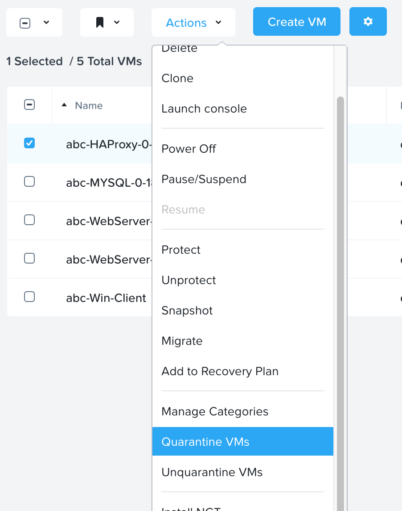
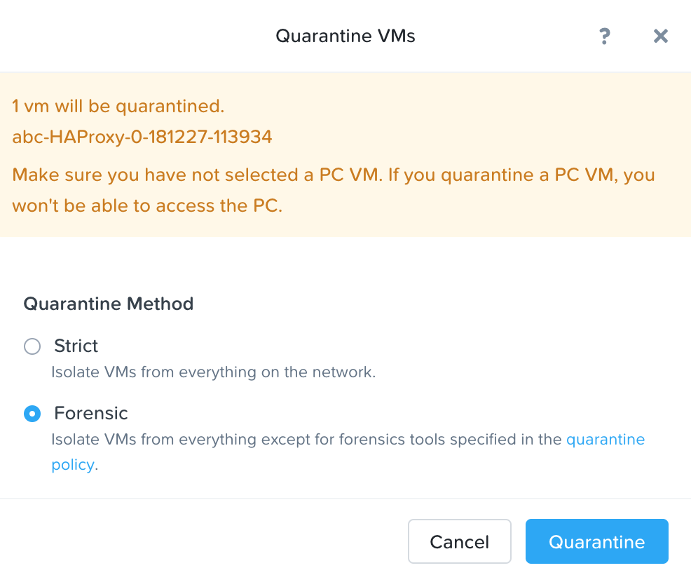
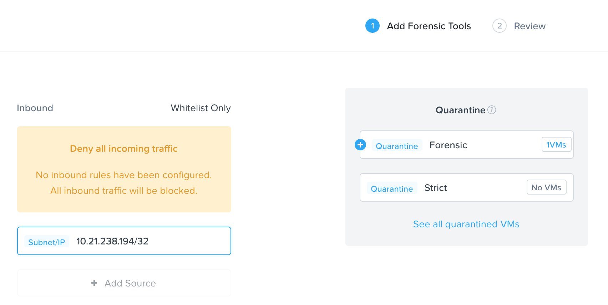
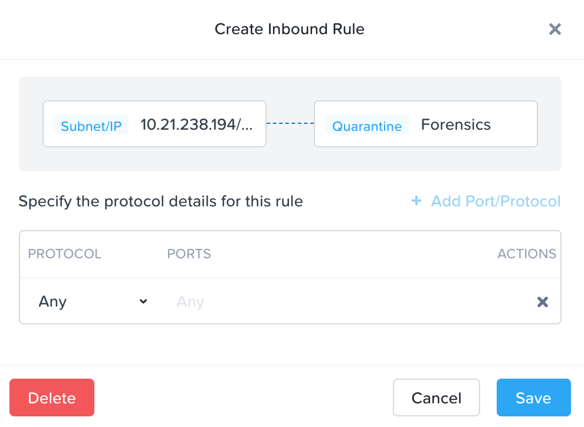

.. _flow_quarantine_vm:

-------------------
Flow: Quarantine VM
-------------------

Overview
++++++++

.. note::

  Estimated time to complete: 5-10 MINUTES

In this task we will place a VM into quarantine and observe the behavior of the VM. We will also inspect the configurable options inside the quarantine policy.

Quarantine a VM and Explore the Quarantine Policy
+++++++++++++++++++++++++++++++++++++++++++++++++

Confirm Task Manager App Availability
.......................................................

Log on to the Prism Central environment and navigate to <icon>hamburger menu **Services > Calm**.

Navigate to <icon>hamburger menu **Virtual Infrastructure > VMs** and type your initials into the search bar. Click **View all X VMs**, select your Windows client VM, and click **Actions > Launch Console**.

.. figure:: images/flow_q_1_console.png

Find the IP of the newly deployed Load Balancer VM in the VM list.

From the Windows Client VM open a web browser and enter the IP address of the load balancer. Confirm that the Task Manager web application loads and that tasks can be added or deleted from the web interface.

Click the Start menu, type cmd.exe, and type ping <load balancer IP>.

Once connectivity is confirmed, enter **ping -t <load balancer IP>** as an ongoing connectivity test from the Windows client VM to the database.

Quarantine a VM and Edit The Quarantine Policy
..............................................

Quarantine the load balancer HAProxy VM in your Task Manager application by navigating to <icon>hamburger menu **Virtual Infrastructure > VMs**.

Select **abc-HAProxy-X-XXXX-XXXX > Actions > Quarantine VMs**. 

Select **Forensic** and click **Quarantine**.

What happens with the continuous ping between your Windows client and the load balancer? Can you access the Task Manager application web page from the Windows client?

Navigate to <icon>hamburger menu **Policies > Security Policies > Quarantine**.

Select **Update** in the top right corner then select **+ Add Source** to the Quarantine policy.

Add a source by **Subnet/IP** with the IP address of the Windows client VM, and a netmask of **/32**. 

What targets can this source be connected to?

What is the difference between the Forensic and Strict quarantine mode?

Click on the plus sign ( + ) near **Forensic** category and allow any protocol on any port to the Forensic quarantine category.

Select **Next > Apply Now** to save the policy.

What happens to the pings to the load balancer after the source is added? Can you access the Task Manager web application?

Unquarantine the load balancer VM by navigating to **abc-HAProxy-X-XXXX-XXXX > Actions > Unquarantine VMs**.

Takeaways
+++++++++

- In this exercise you utilized Flow to quarantine a VM using the two modalities of the quarantine policy, which are strict and forensic.
- Quarantine policies are evaluated at a higher priority than application policies. A quarantine traffic can block traffic that would otherwise be allowed by an application policy.
- The forensic modality is key to allow limited access a quarantined VM while the VM is quarantined.
