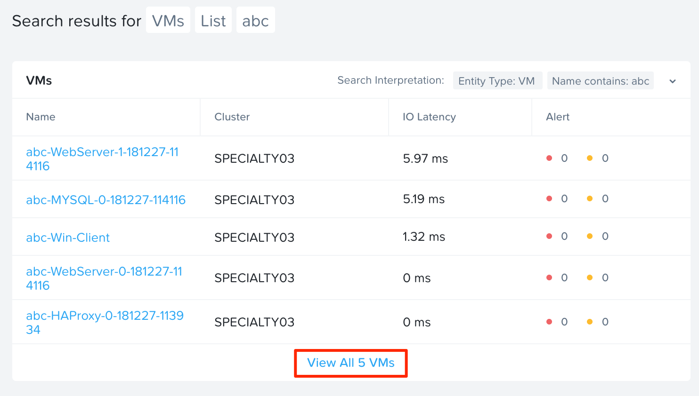
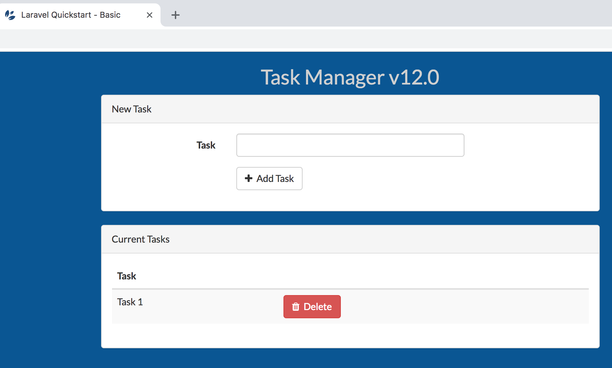
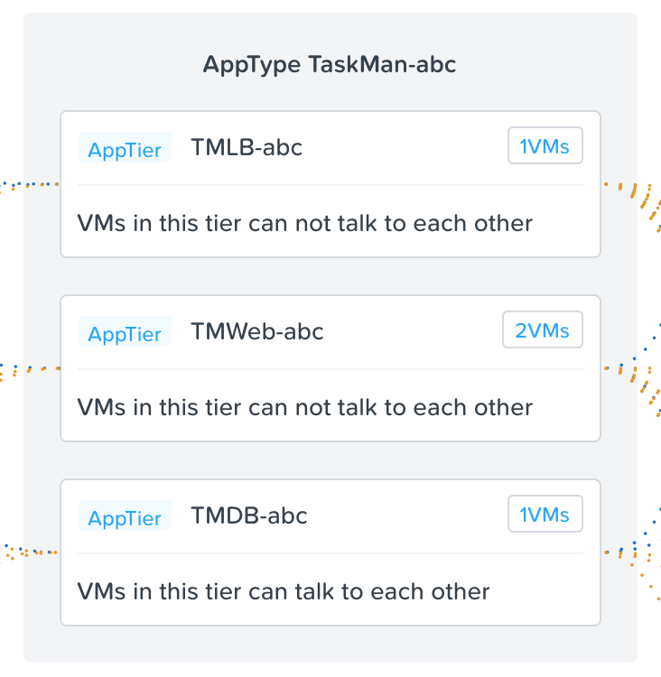
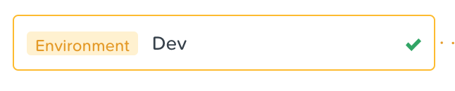
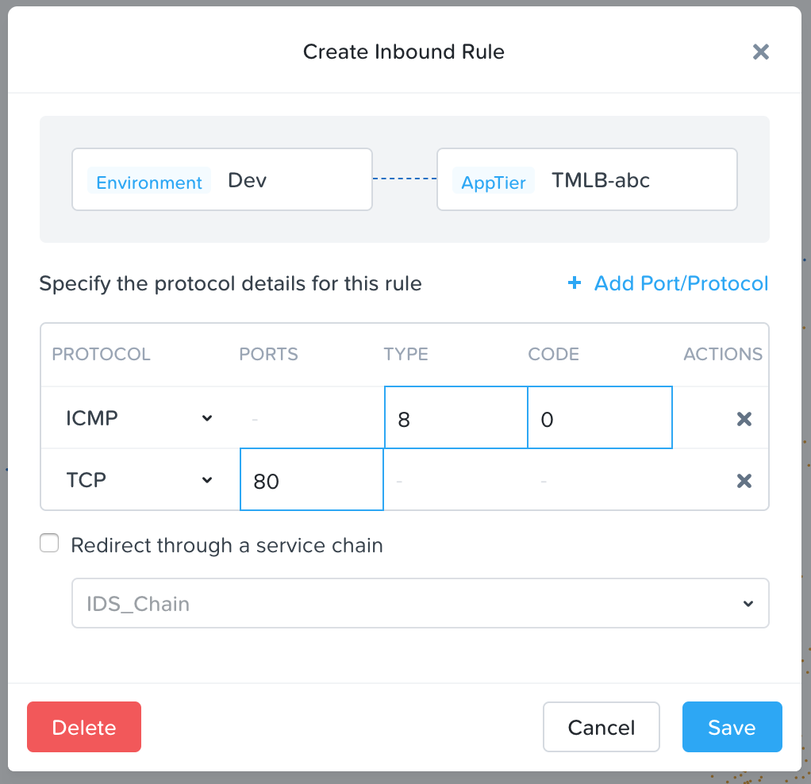

.. _flow_verify_app:

------------------------
Flow: Verify Application
------------------------

Overview
++++++++

.. note::

  Estimated time to complete: 15-30 MINUTES

In this exercise you will verify that the Flow security policy is monitoring the new application. For this, the Calm blueprint previously launched should be provisioned successfully.

Verify The Flow Application Security Policy
+++++++++++++++++++++++++++++++++++++++++++

Access Task Manager Application
-----------------------------------------
Before evaluating the Flow security policy, verify that the Task Manager application is running.

Open the Console of the Windows client VM using Prism Central.

From the navigation menu, select **Virtual Infrastructure > VMs** and type your initials into the search bar.

Click **View all 5 VMs**, select your Windows client VM, and click **Actions > Launch Console**.

Find the IP of the newly deployed load balancer HAProxy VM in the VM list.

From the Windows Client VM open a web browser and enter the IP address of the load balancer. Confirm that the Task Manager web application loads and that tasks can be added or deleted from the web interface.

Verify Application Categories
---------------------------------
Calm provisions the VMs for the applications with the correct categories during VM creation. These categories should place the VMs into the Application Security Policy created in previous steps. Verify that the VMs are properly categorized.

From the navigation menu, select **Policies > Security Policies > AppTaskMan-abc**.

Verify the number of VMs in the three application tiers. The load balancer and database tier should have one VM. The web tier should have two VMs.

Click on the VM count to see a list of the VMs inside the tier.

Select the checkbox next to any VM in the application and navigate to **Actions > Manage Categories**.

Note the categories applied to the VM as well as the associated security policy.

Access the Application Tiers
----------------------------
The application security policy **AppTaskMan-abc** does not allow any outside access to the database tier, but this policy is currently in monitor mode. Confirm that the Windows client VM can ping the database VM.

Open the console of the Windows Client VM.

Click the Start menu, type cmd.exe, and type ping <database server IP>.

Once connectivity is confirmed, enter **ping -t <database server IP>** as an ongoing connectivity test from the Windows client VM to the database.

Repeat the above steps using ping <load balancer IP> as well.

Add Flows to a Policy Using Flow Visualization
..............................................

View Detected Traffic Flows
---------------------------

From the navigation menu , select *Policies > Security Policies > AppTaskMan-abc** to view the detected traffic flows to and from the Task Manager application.

Confirm that **Environment: Dev** is listed as a source. The source box and line should appear in yellow to indicate the detected ping and web traffic from our Windows client VM in the dev environment. This can take a few minutes to appear.

Hover over the yellow flow line from **Environment: Dev** to **AppTier: TMLB-abc** to view the protocol and connection information.

Click the yellow flow line to view a detailed graph of connection attempts for the past 24 hours.

.. figure:: images/flow_verify_5_dev_detected.png

Are there any other detected traffic flows inbound or outbound? Hover over these connections and determine what these ports are used for.

Add The Detected Flow to The Security Policy
--------------------------------------------
Select **Update** in the top right corner to edit the policy.

Click **Next** and view the detected traffic flows.

Hover over the **Environment: Dev** source in the inbound list that connects to **AppTier: TMLB-abc**.

Select the green check box to add this source to the inbound allowed list.

Select OK to Add to Rule

Hover over the blue **Environment: Dev** source and select the pencil icon to edit the source.

Select the pencil on **AppTier: TMLB-abc** to define specific ports and protocols.

Currently ICMP is allowed due to the ping detected in the previous task. Add TCP port 80 to the rule.

Select **Save** to save rule.

Select **Next** to review the changes to the policy.

Move Policy from **Monitoring** Mode to **Applied** Mode
------------------------------------------------------------
Now that the policy is complete, move it from monitor mode to apply mode. to start blocking traffic.

Select **Apply Now** to save the policy and move it into apply mode.

From the Navigation menu, **Policies > Security Policies > AppTaskMan-abc**.

Confirm that **Environment: Dev** shows in blue as an allowed source.

What happens to the continuous ping traffic from the Windows client to the database server? Is this traffic blocked?

Verify that the Windows Client VM can still access the Task Manager application using the web browser and the load balancer IP address.

Verify SSH console access from Calm to the load balancer, web, and database service VMs, which uses TCP port 22.

Takeaways
+++++++++
- Calm can provision VMs with Flow categories so these VMs are immediately protected by a security policy.
- Flow visualization allows you to see the flows that are occurring within a policy. From there it's easy to add the flows that should be allowed.
- Policies created in Monitor mode allow all traffic.
- Switching an application policy to Apply mode blocks traffic unless specifically allowed by the policy.
