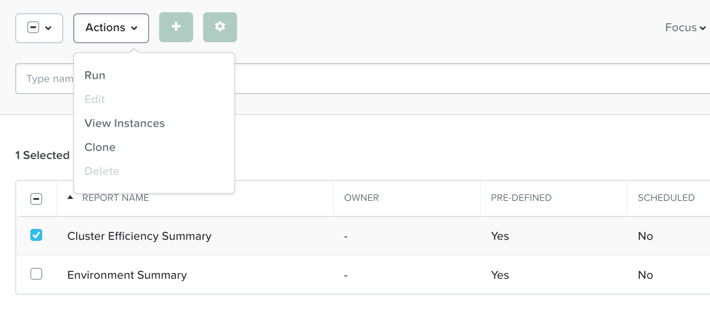

.. _lab_monitoring_env:

----------------
Lab - Monitoring
----------------

Overview
++++++++

Learn about Prism Central’s monitoring and resource planning features that help you stay on top of cluster utilization and more accurately predict cluster expansions.

Prism Central Reports
+++++++++++++++++++++

Prism Central allows you to generate historical reports about your cluster environment.

Such reports can include resource consumption, abnormal behavior, and other valuable operational insights.

In **Prism Central > Explore > Reports**.

Lets run the **Cluster Efficiency Summary** report.

Select **Cluster Efficiency Summary**, then click **Run** from the **Actions** drop-down menu.

Next, fill out the following fields and click **Run**:

- **Report instance Name** - Cluster Efficiency Summary - *initials*
- **Time Period for Report** - Last 24 Hours

Now lets run the **Environment Summary** report.

Select **Environment Summary**, then click **Run** from the **Actions** drop-down menu.

Next, fill out the following fields and click **Run**:

- **Report instance Name** - Environment Summary - *initials*
- **Time Period for Report** - Last 24 Hours

Once the reports are complete, select each report, and do the following:

Click **View Instances.** from the **Actions** drop-down menu.

- To view the report in a separate tab, click the name of the report.
- To download the report, select its check box, then click **Download** at the upper right of the screen.

Review the contents of the reports you created in this exercise.

Capacity Runway
...............

Use Prism Central’s Capacity Runway feature to learn about cluster resource planning and recommendations.

In **Prism Central > Planning > Capacity Runway**.

- Note the runway summaries showing the days left for each cluster.
- How long does the current cluster has before it runs out of memory, CPU, and storage?

Click one of the clusters.

.. note::

  The most constrained resource is highlighted on the left side.

.. note::

  Clicking Storage, CPU, or Memory Runway displays the chart for that resource.

Click **Optimize Resources** to see a list of recommended management tasks for reallocating resources, such as optimizing over-provisioned VMs, deleting inactive VMs, or adding resources to constrained VMs.

Close the Capacity Runway view.

What If Planning
................

Push the initial guess of the capacity planning task to add hypothetical workloads and see how the prediction changes.

In **Prism Central > Planning > Scenarios**, then click **New Scenario**.

Next, fill out the following fields:

- **Cluster** - Select a Cluster Model
- **Target** - 6 months
- **Vendor Type** - Nutanix

Now lets add a 150 seat Citrix XenDesktop workload..

Click **+ Add Workload**.

Next, fill out the following fields and click **Add Workload**:

- **Workload** - VDI
- **Vendor** - XenDesktop
- **User Type** - Power Users
- **Provision Type** - Machine Creation Services (MCS)
- **Number of Users** - 150
- **On** - One Month from now

Repeat this process, adding workloads until the runway falls short of the six-month target.

**Save** this scenario.

Note the **Resources** section, which shows the existing hardware.

Click **Recommend** to see a suggested NX configuration to extend the runway.

Now lets experiment with changing the target and workloads and generating recommendations:

- Additional 150 seats in three months.
- Change in demand every three months.

Generate a PDF report to see detailed capacity planning information.

Bonus Round: Create a Custom Report
...................................

To create a new custom report from scratch, click the plus sign beside **Actions**, then add the desired metrics from the pane on the left side.

Once you have saved the custom report, you can run it just as you would run any other report.

To set a report to run automatically, add a schedule to it.

Takeaways
+++++++++

- The Prism Central report management feature provides you with an ability to configure and deliver the historical reports containing information about the infrastructure resources straight into your mailbox according to the schedules configured.
- The Capacity Runway view in the Planning dashboard allows you to view summary resource runway information for the registered clusters and access detailed runway information about each cluster.
- The Scenarios view in the Planning dashboard allows you to create "what if" scenarios to assess the future resource requirements for potential work loads that you specify.
- You must have a Prism Pro license to use the resource planning tools.
