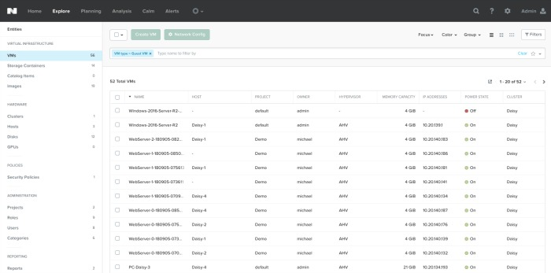
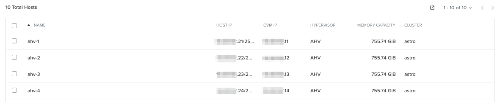
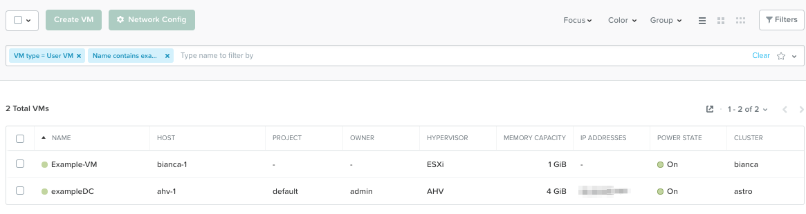

.. _lab_prism_central_overview:

---------------------------------
Lab - Nutanix Prism Central Overview
---------------------------------

Overview
++++++++

This lab will introduce the Prism Central UI, and familiarize you with its layout and navigation.

Prism Central
+++++++++++++

Open https://<*Prism-Central-IP*>:9440

Fill out the following fields and click **Enter**:

- **Username** - admin
- **Password** - *HPOC Password*

After you log in to Prism Central, familiarize yourself with the Prism UI.

Explore the information on the **Home** screen:

- Cluster Runway
- Cluster Quick Access
- Impacted Cluster | Alerts
- tasks

Review the **Explore** screen:

- VMs
- Images
- Clusters
- Hosts
- Disks
- Storage Containers

Review the other sections, and do a quick walk through:

- Planning
- Analysis
- Apps (We will configure this later in the workshop)
- Alerts
- Tasks :fa:`circle-o`
- Search :fa:`search`
- Help :fa:`question`
- Configuration :fa:`cog`
- User :fa:`user`

.......................
Prism Central UI Review
.......................

How would you find the screen that shows you a table of all the hosts managed by an instance of Prism Central?

.. note::

  If this Prism Central instance was managing multiple clusters, this screen would show the hosts for all of the clusters being managed.

In **Prism Central > Explore**, click **Hosts** on left-hand menu.

How would you find the screen that lists all of the VMs currently deployed. This screen looks similar to the figure below?

In **Prism Central > Explore**, click **VMs** on left-hand menu.

What page would show you the latest activity in the system? On this page, you can monitor the progress of any task and keep track of what has been done in the past using time stamps. Can you figure out two different ways to get there?

First Way, In **Prism Central > Home**, click **View All Tasks**. Second Way, click :fa:`circle-o`

.. note::

  In ESXi:

  - vCenter Server instances can be registered to Prism via Prism's :fa:`cog` icon.
  - Registering a Nutanix Cluster running ESXi with vCenter allows to perform core VM management operations directly from Prism without switching to vCenter Server.
  - The vCenter Server that is managing the hosts in the cluster is auto-discovered and its IP address is auto-populated in the Address field as shown in the example below.

  Example view of vCenter registration to Prism:

  .. figure:: images/nutanix_tech_overview_15.png

Takeaways
+++++++++

- Prism is thoughtfully laid out UI
- Critical information is displayed front and center
- Prism Central can manage multiple clusters
