.. _monitoring_and_managing_env:

-----------------------
Monitoring and Managing
the Environment
-----------------------

Monitoring and Managing the Environment
+++++++++++++++++++++++++++++++++++++++

Now that we have our Nutanix cluster configured and the workloads are deployed and protected, we can learn about how to monitor and manage our Nutanix cluster.

One-Click Cluster Upgrade
.........................

What is it?

- Automatically upgrade Nutanix software non-disruptively with no manual intervention
- Automatically upgrade hypervisors non-disruptively with no manual intervention
- Automatically upgrade firmware non-disruptively with no manual intervention

Key Points:

- Automatic sequencing of reboots
- Done in minutes with zero touch
- No downtime while upgrade happens
- As easy as upgrading iOS

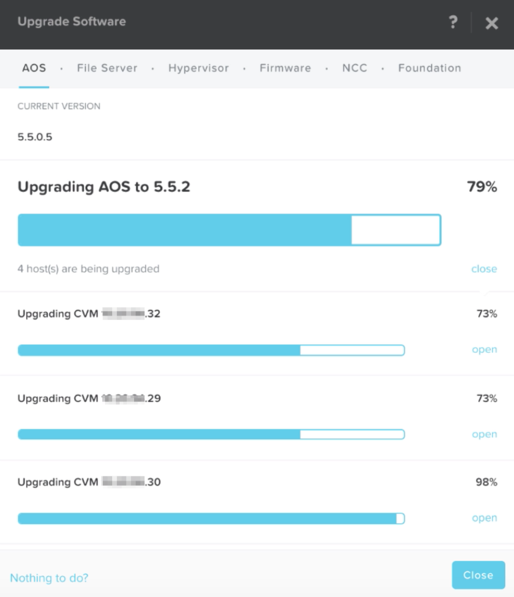

One-click Hypervisor Conversion
...............................

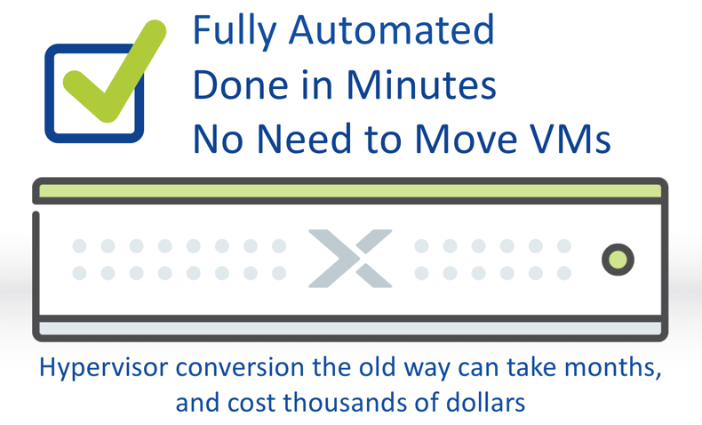

Simple Cluster Expansions
.........................

Expand the cluster by adding nodes at any time with the ease of a few clicks.

Can expand a cluster while it’s running.

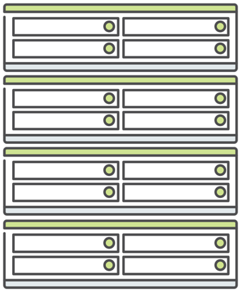

Prism Central Dashboards
........................

What is it?

- Custom Dashboards
- Widget Based
- Full Drill-down
- Exec Summary Reports

Benefits:

- Important Summarization

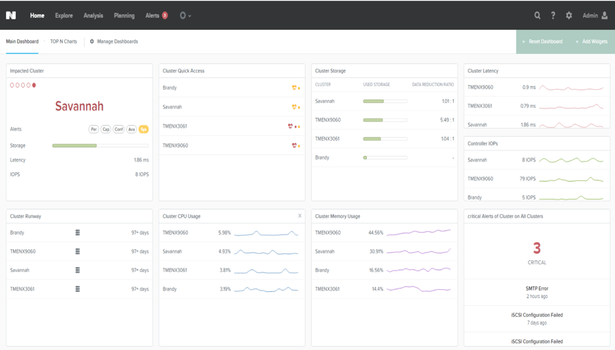

Network Visualization
.....................

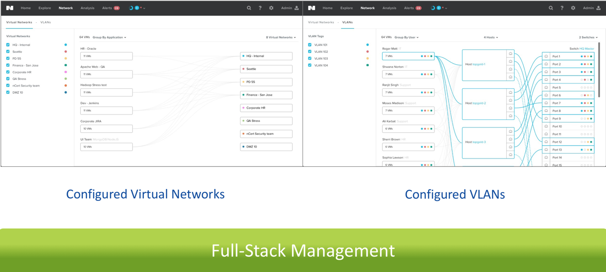

Prism Self-Service
..................

What is it?

- Self-service access to IT resources
- IT sets policies and provides access to end users such as developers

Components:

- Admin Portal: Create projects, set policies, assign users
- End User Portal: Deploy and monitor applications

Benefits:

- Frictionless service delivery
- Developers empowered to get AWS like experience

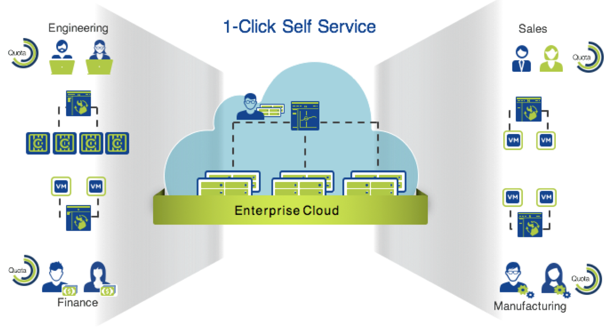

Nutanix Calm
............

Part of The Nutanix Solution Stack

.. figure:: images/monitoring_and_managing_07.png

Prism Central Report Managing and Machine Learning Capability
.............................................................

With PC Machine learning you can:

- Analyze resource usage over time.
- Monitor resource consumption.
- Identify abnormal behavior.
- Take advantage of guided resource planning.

With report management you can:

- Configure and deliver the historical reports containing information about the infrastructure resources.
- Gain operational insights of your infrastructure into your mailbox according to the schedule that you have configured.

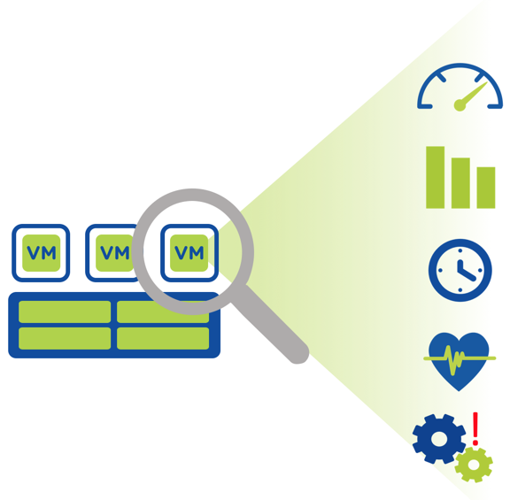

Actionable Capacity Forecasting
...............................

What is it?

- Detailed capacity trends
- Intelligent recommendations
- Powered by patent pendingX-FIT algorithm

Key Points:

- Enables pay as you grow capacity expansion
- Eliminates guesswork

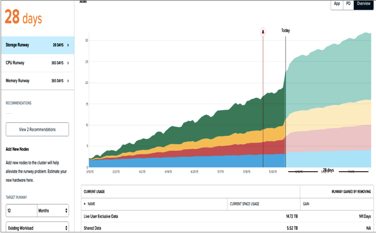

Just-In-Time Forecast
.....................

What is it?

- Machine learning based forecast that predicts capacity expansion to meet future workload growth
- Planning of expansion based on existing/new workload demands
- Powered by X-FIT

Benefits:

- Pre defined workload friendly inputs to save planning time and avoid hassle
- Enables pay as you grow capacity expansion
- Eliminates guesswork

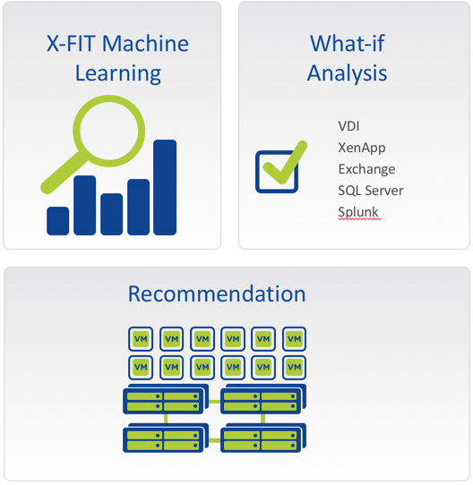

Rich and Insightful Analytics
.............................

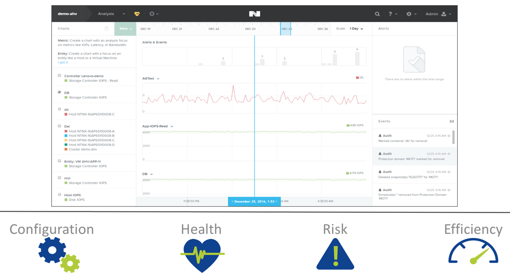

VM Management for ESXi
......................

What is it?

- ESXi Management from Prism
- Does not displace vCenter

Use Prism for common use cases:

- VM Create
- VM Update
- VM Delete
- VM Power On/Off Ops
- Launch console
- Clone

Key Points:

- Consumer-grade virtualization management across different hypervisors
- Unified management plane for virtualization, storage and compute

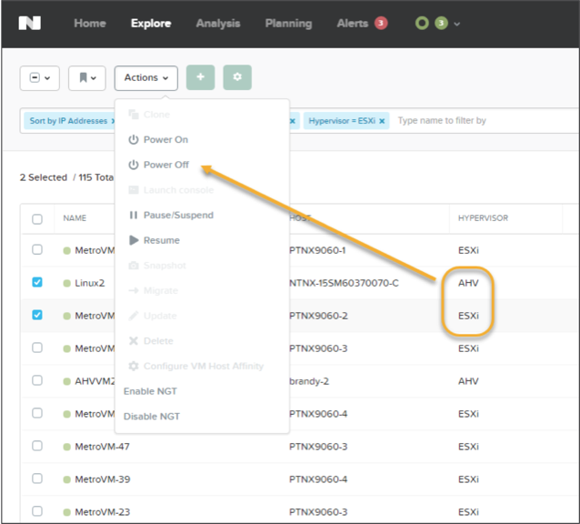

Video Demonstration: Cluster Software Update
............................................

This demo shows how easy it is to upgrade a Nutanix cluster. Software upgrades are non-disruptive to the environment and can be performed at any time.

Cluster Upgrade - https://youtu.be/_dzyaWbRkAQ

Video Demonstration: Cluster Expansion
.......................................

This demo shows the ease with which a cluster could be expanded through the addition of one more node into the demo environment.

Cluster Expansion - https://youtu.be/qg0vU48d5XA
